# Whitepaper

Lucia Protocol is a non-custodial lending and borrowing platform aimed at providing frictionless credit access to both individuals and startup enterprises. At its core, Lucia stands out for revolutionizing the financial sector, offering a comprehensive credit evaluation process that takes into account a multitude of both on-chain and off-chain metrics. This credit availability is intended not just for short-term needs but also for operational sustainability and long-term growth.

This platform allows users to participate as either lenders or borrowers. Lenders can add liquidity to the platform and earn returns through interest and shared platform revenue. Borrowers can apply for loans after undergoing a simple and easy credit analysis and scoring system. The platform offers competitive collateralization rates, which means that borrowers can access credit up to 100% of the value of their collateral.

As for incentives, Lucia Protocol distributes all rewards in its native LUCI tokens. Privacy is also a priority; the protocol employs zero-knowledge proofs to ensure confidentiality in credit score evaluations. Operating on the Polygon network, Lucia currently supports a diverse set of cryptocurrency assets, including but not limited to USDC, USDT, DAI, AVAX, ETH, and MATIC.

#### Contents

- [Introduction](#introduction)

- [Features Overview](#benefits)
    
    - [Attribution Credit Scoring System](#attribution)

    - [Low Collateralized Ratio (100%)](#collateral)

    - [Enhanced Privacy with Zero Knowledge Proofs](#zeroKnowledge)

    - [Default Protection Insurance](#protection)

    - [Lender/Borrower Reward System](#lender/borrower)

    - [Virtual Credit Card](#virtualCredit)

    - [Flash Loans](#flashLoans)

- [System Overview](#systemOverview)

    - [Tokenomics](#tokenomics)

    - [The LUCI Token](#LUCIToken)

    - [The LCI Token](#LCIToken)

    - [The stLCI Token](#stLCIToken)

    - [Barns and Sheds](#barns)

    - [Silos](#silos)

    - [Plots](#plots)

    - [Protocol Owned Liquidity](#liquidity)

    - [The Treasury](#treasury)

- [System Functionality](#functionality)

    - [Borrower Operations](#borrowerOperations)

        - [Borrowing Fees](#411-borrowing-fees)

    - [Lender Operations](#lenderOperations)

    - [Silo Operations](#43-silo-operations)

    - [Redemption Mechanism](#44-redemption-mechanism)

    - [Credit Reputation](#creditReputation)

    - [Liquidation](#liquidation)

    - [Credit Default Risk](#47-credit-default-risk)

        - [CDI Architecture](#471-cdi-architecture)

        - [Smart Contract-based Architecture of CDI System](#472-smart-contract-based-architecture-of-cdi-system)

    - [Risk Management](#riskManagement)

    - [Insurance Claims & Entitlements](#49-insurance-claims--entitlements)

    - [Governance & Investments](#410-governance--investments)

- [Rewards System](#rewardsSystem)

    - [Lenders](#lenders)

    - [Borrowers](#borrowers)

    - [Token Rewards](#tokenRewards)

- [Conclusion](#conclusion)

## 1. Introdction

The traditional financial system presents a series of challenges for startups and enterprising individuals seeking credit. The cumbersome, often complicated, application processes act as significant barriers to obtaining much-needed funding. The scale of this issue is starkly illuminated by World Bank data, which reports that a staggering 1.7 billion people globally are left without any banking or credit options. This glaring gap highlights the critical need for disruptive solutions to revolutionize the way credit is allocated.

Adding to the urgency, a conventional credit application process can drag on for up to 10 business days, only to yield dismally low approval rates. This inefficient and opaque system further underscores the need for streamlined, transparent methods to accelerate access to credit.

Moreover, traditional credit scoring models are not equipped to adequately assess startups or individuals lacking a robust credit history. Such limitations point to an immediate requirement for a more nuanced and adaptable framework for credit evaluation that can adjust to the unique circumstances of each applicant.

Further exacerbating these challenges, the traditional finance model is often laden with high fees and interest rates, placing an extra burden on those already deemed high-risk. This creates a vicious cycle that can significantly impede financial growth and innovation, thus underlining the need for alternative financing solutions that enable rather than restrict borrowers.
To tackle these multi-faceted challenges, Lucia Protocol stands out as an innovative and pioneering solution. It offers an alternative credit pathway for both startups and individuals, made possible by leveraging innovative credit assessment methodologies, competitive collateralization terms, and employing zero-knowledge proofs for enhanced privacy. Through Lucia Protocol, the vision of democratizing credit access for all comes a significant step closer to reality.

## 2. Features Overview

The Lucia Protocol employs an array of innovative features that reshape the lending and borrowing landscape:

- Attribution Credit Scoring System

- Low Collateralized Ratio (100%)

- Enhanced Privacy with Zero Knowledge Proofs

- KYC/KYB Integration

- Default Protection Insurance

- Lender & Borrower Reward System

- Virtual Credit Card

- Flash Loans

### 2.1 Attribution Credit Scoring System

Lucia Protocol introduces an innovative Attribution Credit Scoring System, engineered to deliver an accurate and comprehensive assessment of borrowers' creditworthiness. Unlike traditional models that heavily rely on a singular data set, Lucia's system adopts a multi-dimensional approach by amalgamating both on-chain and off-chain data.
The On-chain Score is computed by aggregating key parameters such as users' transaction history and interactions within the blockchain network. This rich layer of data offers a granular view into users' financial activities and risk profiles, thereby augmenting the reliability of the credit evaluation.

On-Chain Score Formula:

In addition to on-chain data, Lucia's credit scoring mechanism incorporates off-chain sources, delving into external financial data such as credit history and employment records. By considering a broader range of financial activities and behaviors, the mechanism forms a complete picture of borrowers' financial standing.

Off-Chain Score Formula:

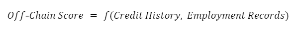

Combined Credit Score Formula:

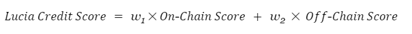

The integration of on-chain and off-chain data results in a comprehensive overview that minimizes reliance on a single data source. Consequently, Lucia's Attribution Credit Scoring System ascertains creditworthiness with a higher degree of accuracy.

### 2.2 Low Collateralized Ratio (100%)

Within the traditional lending ecosystem, borrowers often find themselves restrained by high collateral requirements—commonly set at 120% of the loan value. This mandates that borrowers lock in assets exceeding the credit they wish to procure, limiting their financial agility. Lucia Protocol challenges this convention by introducing a revolutionary 100% Collateralized Ratio.
In Lucia's model, this ratio can go as low as 100%, signifying that borrowers can leverage their entire collateral to access equivalent credit amounts. This innovation expands the borrowers' potential for more significant credit access, effectively democratizing financial inclusivity.

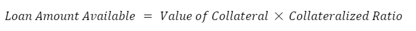

By setting the Collateralized Ratio at 100%, Lucia Protocol amplifies the ability for borrowers to fully capitalize on their assets, offering a more flexible and accessible credit framework.

### 2.3 Enhanced Privacy with Zero Knowledge Proofs

Lucia Protocol pioneers an advanced methodology aimed at privacy preservation through the utilization of Zero-Knowledge Proofs. This cryptographic technique ensures that while borrowers' creditworthiness is accurately computed, specific financial data remains undisclosed.

Zero-Knowledge Proof Formula:

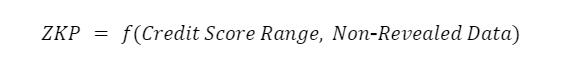

In this formula, the Zero-Knowledge Proof (ZKP) is a function of the borrower's credit score range and other non-revealed data. The protocol thereby verifies the authenticity of the borrower's credit score without necessitating the exposure of the underlying financial information.

In synergy with Zero-Knowledge Proofs, Lucia Protocol has engineered a robust platform known as dAccess-as-a-Service (dAaaS), aimed at revolutionizing trust and identity services within the loan markets.

dAaaS Service Formulas:

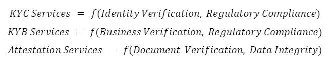

These formulas encapsulate various dAaaS services including Know-Your-Customer (KYC), Know-Your-Business (KYB), and Attestation Services, all of which are tailored to meet loan market requirements. 

Functionality Formulas:

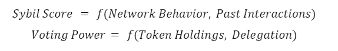

These functionalities, such as decentralized Sybil scores and voting power mechanisms, further contribute to the development of new-age decision-making and governance models within Decentralized Autonomous Organizations (DAOs).
By integrating Zero-Knowledge Proofs and dAaaS, Lucia Protocol ensures that the borrower's creditworthiness is ascertained in a secure environment. Users can thus be confident that their sensitive financial data is both accurately represented and thoroughly protected.

### 2.4 Default Protection Insurance

Lucia Protocol's Credit Default Insurance (CDI) serves as a financial safety net against unexpected credit events by employing principles of risk pooling, risk transfer, and indemnification. The insurance relies on an upfront premium, calculated based on proprietary credit risk metrics, to create a reserve fund, known as the "insPlot." This fund is also strategically invested to generate additional revenue and expand the reserve for new policies. 

Through diversification and advanced risk management techniques, including the Law of Large Numbers, Lucia Protocol aims to balance its risk exposure while optimizing the premium rates. These premiums are set to be both competitive and sufficient to cover operational costs and claim payouts. In a default event, the CDI activates to compensate the creditors, thereby maintaining the overall system's stability and solvency.

### 2.5 Lender/Borrower Reward System

The Lucia Protocol establishes a compelling reward system for liquidity providers or lenders, encouraging them to contribute various supported assets such as USDC, USDT, AVAX, MATIC, and ETH into the liquidity pool. In doing so, they bolster the protocol's overall liquidity and operational efficiency. Furthermore, lenders have the unique opportunity to fund specific asset pairs like USDC/MATIC, thereby enriching the scope of their financial engagement with the protocol.

**Lender Incentives**

Lucia Protocol will  introduce the issuance of NFTs that represent bundled assets and liquidity. These NFTs also confer entitlements to specific rewards and interests. By making these NFTs tradable on secondary markets, Lucia Protocol offers lenders a novel mechanism to exit their liquidity positions prior to loan maturity if desired.

**Borrower Incentives**

For borrowers, Lucia Protocol goes beyond basic loan facilitation by incentivizing responsible financial conduct. Borrowers who meet their repayment obligations punctually and without incurring penalties stand to receive rewards in the form of cashback. Specifically, these rewards are dispensed as a 3.5% cashback in Lucia Protocol's native token, LUCI.

### 2.6 Virtual Credit Card

In the upcoming phases, borrowers will be granted the option to leverage a virtual credit card provided by Lucia for tangible transactions.

Crucially, the associated transaction fees for these virtual credit card operations will consistently maintain a level below the conventional charges typically associated with traditional credit cards. This advantageous cost structure amplifies the financial viability for borrowers.

Furthermore, this characteristic will also empower borrowers to amass cashback rewards of up to 3.5% upon the successful completion of their loan settlement. These rewards are positioned as an incentive to promote prudent borrowing practices and prompt repayment, thereby conferring supplementary benefits to borrowers.

### 2.7 Flash Loans

The utility of credit in modern finance cannot be overstated; it enables the generation of new and sustainable value across various user demographics. However, the misuse of credit, particularly in the form of borrower defaults, can undermine its benefits by creating systemic risks such as unpaid principal and accumulated interest. This raises a crucial question: Is it possible to provide credit without the inherent risk of borrower default?

**The Flash Loan Solution** 

The Lucia Protocol introduces its flash loan feature as a strategic response to this question. Flash loans have the potential to significantly impact various facets of the decentralized finance (DeFi) landscape, including but not limited to, automated market makers (AMMs), decentralized exchange (DEX) fees, and overall ecosystem functionality.

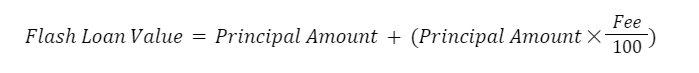

Where Flash Loan Value is the total amount to be returned by the borrower, with Principal Amount as the initial borrowed amount, and the Fee is the fixed percentage fee for the flash loan service. 

**User Applications**

Flash loans offer unique advantages to both liquidity providers and borrowers, particularly when used effectively.

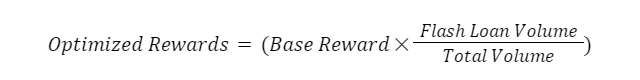

Where Optimized Rewards represents the additional rewards users could potentially earn, with Base Reward as the fundamental reward offered by the platform. Flash Loan Volume represents the total value transacted through flash loans and Total Volume is the overall transaction volume on the platform. 

**Internal Applications**

Within the Lucia Protocol, flash loans are not merely an auxiliary feature; they are integral to the development of enhanced user functionalities. For instance, they enable the protocol to:

 - Refine AMM strategies for better market making.

 - Maximize revenue generation and optimization for the treasury.

 - Efficiently manage collateral liquidations.

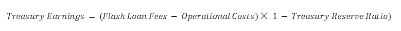

Where Treasury Earnings are the additional earnings for the treasury and FlashLoan Fees represent the total fees collected from flash loan operations. Operational Costs include the cost of executing flash loans with the Treasury Reserve Ratio as the percentage of earnings reserved for liquidity or other purposes. 

## 3. System Overview

### 3.1 Tokenomics

The following diagram summarizes the token flows between the Protocol and its users:

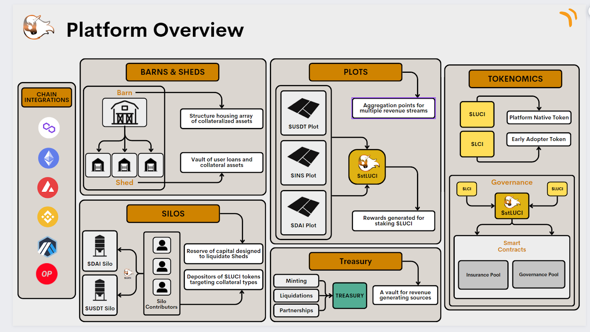

**Token Name:** LUCI

Max Supploy: 100,000,000

Initial Circulating Supply: 10,000,000

**Token Name 2** LCI

Max Supploy: TBD

Initial Circulating Supply: TBD

**Token Distribution:**

- Public Sale via Reg A Tier 2 Offering: 10% (10,000,000 LCI)
- Team & Advisory Board: 15% (15,000,000 LCI - w/ 3-year vesting period)
- Marketing: 10% (10,000,000 LCI)
- Treasury: 33% (33,000,000 LCI)
- Community Rewards: 17% (17,000,000 LCI)

**Token Utility:**

- Governance: LCI token holders can vote on proposals - is it LCI token holders as well?
- Staking: LCI token holders can stake their tokens to earn rewards 
- Discounted Fees: LCI tokens can be used to receive discounts
- We need to add Trading: LCI tokens can be used to issue arb trades

**TVL Calculation for Lucia Protocol:**

In this equation, Asset_i refers to the iˆth asset supported within the Lucia Protocol ecosystem. The term Quantity of Asset_i indicates the total volume of that particular asset (Asset_i)that is currently being lent out or utilized as collateral within the platform. Conversely, Price of Asset_i denotes the present market valuation of Asseti, expressed in USD.

### 3.2 The LUCI Token

LUCI is a stablecoin anchored to a treasury reserve, designed to simplify the user experience in the digital asset space. It allows individuals to mint LUCI tokens by pledging established stable assets—such as USDT, USDC, and DAI—into a dedicated treasury. This process not only enables the issuance of LUCI tokens but also offers liquidity for users. Importantly, at any point, users can opt to redeem their original assets by repaying the LUCI tokens they have minted.

Built on the Ethereum blockchain, LUCI offers robust security and can be stored across an array of digital asset wallets. It is also supported by various platforms that accommodate Ethereum-based tokens. Once minted or acquired, LUCI behaves akin to other cryptocurrencies, meaning it can be transferred, spent on goods and services, or used within the Lucia Protocol's ecosystem for revenue generation through stLCI, the staked iteration of LUCI.

To ensure utmost transparency, every LUCI transaction is recorded and publicly verifiable via the Ethereum blockchain. Each LUCI token in circulation is fully backed by a basket of collateral assets held in the treasury. This mechanism ensures that the overall value of the collateral always exceeds the total circulating LUCI supply.

Currently, LUCI is supported by a diverse portfolio of under-collateralized digital assets, including but not limited to USDT, USDC, and DAI. We are also actively exploring avenues to incorporate additional stable assets into the treasury, thereby broadening the backing of LUCI and enhancing its resilience and stability.

### 3.3 The LCI Token

LCI serves as a crucial secondary token within the LUCIA Protocol's ecosystem, engineered specifically to reward early adopters and contribute to the platform's liquidity. When users stake their LCI tokens, they are converted into stLCI, which subsequently qualifies them for a portion of the revenue generated from various fees within the Protocol. 

**Liquidity Provision through LCI**

Beyond staking, LCI offers another utility: liquidity provision. Users can contribute to the LUCI liquidity pool to receive LCI tokens in return. By doing so, they not only enhance the overall liquidity of LUCI but also gain the opportunity to stake their newly-acquired LCI for additional rewards through stLCI.
By encompassing both incentive mechanisms and liquidity provisions, LCI acts as a powerful tool to engage and reward users, thereby fostering the health, liquidity, and overall robustness of the LUCIA Protocol.

### 3.4 The stLCI Token

The stLCI token serves as the staked version of the LUCIA Protocol's secondary token, LCI. It can be acquired by users through two separate mechanisms. Firstly, by staking their LCI tokens in a designated "PLOT," users can accumulate stLCI tokens. The second pathway to gain stLCI is by providing liquidity directly into the "PLOT." It's important to note that each stLCI token is a unique, non-fungible entity containing four specific data points:

 - Quantity of locked LCI (Q_LCI)

 - Duration of the lock-up period (T)

 - Associated Barn (B)

 - Corresponding weight within the system (W)

**stLCI Acquiring Mechanisms**

Users can acquire stLCI tokens through two separate methods:
• Staking LCI tokens in a designated "PLOT."
• Directly contributing liquidity to the "PLOT."

**Revenue Sharing via stLCI**

Staking LCI to acquire stLCI allows users to participate in multiple revenue streams generated within the LUCIA Protocol. These revenue channels include:

 - Merchant Processing Fees
 
 - Outstanding Balance Rates
 
 - Repay Balance Rewards
 
 - Insurance Premiums
 
 - Insurance Administration Fees
 
 - Loan Liquidations
 
 - Flash Loans
 
 - Discount Swaps
 
 - Bonds

**Lock-up Period and Weighting Mechanism**

One of the unique aspects of stLCI is the user's ability to choose the duration of their LCI token's lock-up period (T). The length of this lock-up is directly proportional to the 'weight' (W) factor that is embedded within each stLCI token. In other words, a longer staking commitment will result in a higher weight, thus influencing the proportion of fee-sharing the user can expect to receive.

This weight directly affects the user's share in the protocol's revenue streams. Specifically, a longer lock-up period corresponds to a higher weight, which in turn translates to a larger proportion of fee-sharing.
R is the total revenue generated and W_i is the weight of the ith stLCI token, which is used to calculate the user’s share S as:

**Long-Term Commitment Incentives**

The stLCI token is crafted to endorse long-term engagement through its weight-based fee-sharing mechanism. Opting for a more extended lock-up period amplifies a user's W, thereby benefiting them with a more substantial share of the generated revenue.

In the broader scope, higher weights aggregate to boost the protocol's overall financial stability and liquidity.

This weighting mechanism not only incentivizes prolonged user engagement but also injects a self-sustaining robustness into the LUCIA Protocol's financial architecture.

### 3.5 Barns and Sheds

Within the LUCIA Protocol, "Barns" serve as the umbrella structure housing an array of collateralized assets, commonly known as "Sheds." Each Shed acts as an individual vault where users can manage their loans and collateral assets. These Sheds are further grouped into different Barns based on the type of collateral, thus minimizing risk by segregating asset classes. In essence, Sheds parallel the concept of Collateralized Debt Positions (CDPs) in traditional DeFi frameworks.

**Balances in the Shed**

Each Shed encapsulates two primary balances:

 - The collateral asset (denoted as C, e.g., USDT)
    
 - The debt balance (denoted as D, typically denominated in our native stablecoin, LUCI)

We can define the Collateral-to-Debt ratio (CDR) as:

**Managing Balances**

Users have the ability to actively manage their Sheds by altering these balances. They can deposit or withdraw collateral, as well as repay portions of their debt. Let's denote:

 - 𝛥C as the change in collateral
 - 𝛥D as the change in debt

The new CDR after any changes is calculated as: 

**Closing Sheds**

Users can also opt to liquidate their Sheds, which are essentially their Collateralized Debt Positions (CDPs). When a user decides to liquidate a Shed, the necessary step involves completely repaying their associated LUCI token debt — designated as (D).  By repaying the LUCI debt in its entirety and thereby reducing D to zero, the CDR essentially becomes undefined—formally represented as:

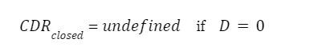

The act of making D zero doesn't just render CDR mathematically indeterminate, but also triggers an automatic release of the user's initially staked collateral. This collateral, previously locked to secure the borrowed amount, is fully returned to the user, effectively 'zeroing out' their financial obligations within that particular Shed. The modular and compartmentalized architecture of Barns and Sheds within the LUCIA Protocol offers both flexibility and risk minimization. By providing detailed insights into each Shed's CDR, users are empowered to make informed decisions about their loans and collateral, thereby enriching the overall lending and borrowing experience.

### 3.6 Silos

The "Silo" functions as the first line of defense in preserving the Protocol's financial solvency. It operates by serving as a reserve of capital designed to liquidate Sheds whose collateral-to-debt ratio is compromised, thereby ensuring that LUCI remains fully collateralized.

**Silo Liquidation Mechanics**

When a Shed is liquidated, the corresponding debt in LUCI is destroyed from the Silo's reserve, while the collateral from the Shed is transferred into the Silo.

Let D be the debt in LUCI associated with a Shed, and C be the collateral in the Shed. When a Shed is liquidated:

 - The debt D is extinguished from the Silo’s reserves:

 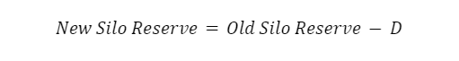

 - The collateral C is added to the Silo:

  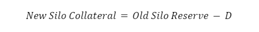

**Silo Contributors**

Users have the opportunity to become "Silo Contributors" by depositing LUCI into the Silo, targeting specific collateral types. This structure allows users to strategize their portfolio diversification while mitigating risks associated with different asset types.

Let L be the amount of LUCI deposited by a Silo Contributor. The proportion P of their share to the total Silo reserve R is:

 

**Financial Benefits**

Over time, Silo Contributors can gain a share of liquidated collateral C. Their share S of any given liquidated collateral is:

 

This allows Silo Contributors to gradually replace their LUCI deposits with other types of assets. Additionally, due to insurance premiums and administration fees, where F is the additional fees associated with the liquidation. The effective gain G for the Silo Contributor would then be:

 

By this model, it's anticipated that G will exceed L, making it a lucrative proposition for Silo Contributors.
Assume a Shed is liquidated with D=1,000 LUCI debt and C=1,000 in collateral. If the Silo Reserve is R=10,000 and a Silo Contributor has L=1,000 LUCI in the Silo, and there are F=100 additional fees: 

 - Proportion P:

 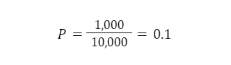

 - Share S:

  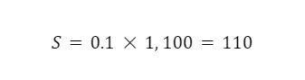

 - Effective Gain G:

 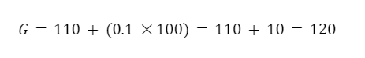

The Silo mechanism offers a proactive method for risk mitigation, aligning with best financial practices seen in sophisticated financial institutions. Over time, Silo Contributors witness a gradual reduction in their LUCI deposits while concurrently acquiring a share of the liquidated collateral. As Sheds are also subject to insurance premiums and administration fees, it is anticipated that the value of the collateral gained by Silo Contributors will exceed the value of the debt they help settle.

Both the Barn & Shed system and the Silo mechanism are integral components designed to uphold the LUCIA Protocol's financial stability and solvency. These interlinked frameworks offer a robust solution for asset management, risk mitigation, and financial benefits for all participants.

### 3.7 Plots

A cornerstone of the Lucia Protocol’s architecture is the "Plot", which serves as the aggregation point for multiple revenue streams generated within the platform. These revenue streams include but are not limited to merchant processing fees, outstanding balance rates, repay balance rewards, insurance premiums, insurance administration fees, loan liquidations, flash loans, discount swaps, and bonds.

**Revenue Distribution**

Prior to allocation into the Plot, a nominal 1% oracle maintenance fee is deducted from the total revenue generated. The remaining 99% is then channeled into the Plot, earmarked for distribution among stLCI holders.

The total revenue R generated is first subjected to a 1% oracle maintenance fee O:

 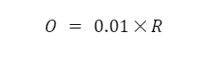

The remaining R - O is then channeled into the Plot: 

 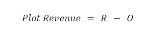

When a user stakes LUCI tokens, they are issued stLUCI tokens which represent a claim on the Plot revenue. Let T be the total number of stLCI tokens and t be the number of stLUCI tokens held by a user. The user's share S of the Plot revenue would be:

 

**Ensuring Platform Health**

The Lucia Protocol introduces a myriad of innovative features designed to address limitations associated with traditional stablecoin platforms:

 - Low Collateralized Ratio (LCR): The LCR allows for better capital efficiency. It is defined as the ratio of the total borrowed amount B to the total collateral C:

 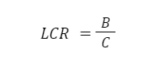

 - Robust Price Floor and Ceiling: The Plot mechanism also maintains a robust price floor and ceiling for tokens by dynamic adjustments. If P is the current token price, F is the floor, and C is the ceiling, then: 

 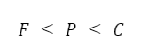

 - Algorithmic Monetary Policy: The protocol uses various algorithms to adjust parameters like interest rates r and minting/burning rates m based on prevailing conditions:

 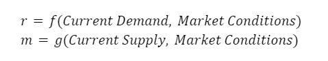

This mechanism enables the protocol to adapt and maintain stability in different market conditions.

**Example**

Assume that total revenue R is 10,000 LUCI, the oracle fee is 1%, and a user holds 100 stLCI out of a total 1,000 stLCI.

 - Oracle Maintenance Fee O:

 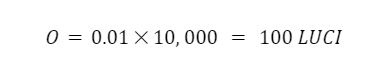

 - Plot Revenue:

 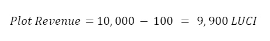

 - User Share S:

 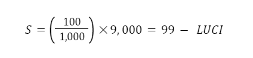

### 3.8 Protocol Owned Liquidity

The concept of Protocol-Owned Liquidity (POL) serves as an innovative solution to challenges associated with liquidity shortages, particularly in volatile market conditions. Under this model, Lucia Protocol offers certain assets at discounted rates, thereby encouraging users to trade their tokens to acquire these assets.

 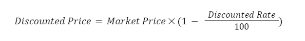

Where Discounted Price is the price at which the asset is offered by the protocol and Market Price is the current market price of the asset. Discount Rate is the percentage by which the asset is discounted. 

**Importance in Ensuring Liquidity**

The strategic employment of POL plays an indispensable role in maintaining liquidity within the Lucia ecosystem. It ensures that users have consistent and reliable access to liquidity pools, even during market upheavals.

 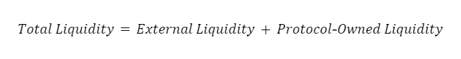

Where Total Liquidity is the sum total of all available liquidity, External Liquidity is the liquidity provided by external participants and Protocol-Owned Liquidity is the liquidity owned by the protocol itself. 

**Mitigating the Liquidity Death Spiral**

Reliance solely on external liquidity providers can lead to severe liquidity crunches during market distress, triggering what is often termed as a "liquidity death spiral."

 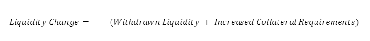

Where Liquidity Change represents the change in available liquidity. Withdrawn Liquidity is the amount withdrawn by external providers and Increased Collateral Requirements is the increase in collateral due to market volatility. 

**Benefits of Protocol-Owned Liquidity**

Protocol-Owned Liquidity offers several compelling advantages:

 - Increased Liquidity: Ensures abundant liquidity irrespective of market conditions.
 
 - Reduced External Reliance: Minimizes dependence on third-party liquidity providers.
 
 - Cost Savings: By using its own assets, the protocol can save on fees.

 - Market Stability: Acts as a counterbalance during market turbulence.

 - Revenue Generation: Allows for various fee-earning activities.

 - Yield Farming Opportunities: Additional avenues for yield generation for users.

 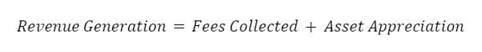

Where Revenue Generation is the total revenue generated via POL. Fees Collected are the transaction fees collected from users. Asset Appreciation is the increase in asset values held in POL. 

### 3.9 The Treasury

The Treasury serves as the backbone of our financial ecosystem, fortified by an array of computational models and strategies aimed at enhancing cash flow, liquidity, and overall asset management. This is particularly vital for ensuring long-term stability and profitability.

**Algorithms for Price Stability**

Key to our Treasury management are advanced algorithms that work cohesively to maintain the value and stability of our native token, LUCI. These algorithms automatically adjust supply parameters and collateral requirements based on current market conditions.

The Supply Adjustment Algorithm can be formulated as:

 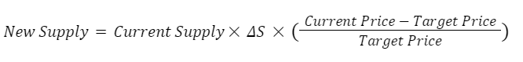

Where 𝛥S is the rate of supply adjustment.

**Protocol-Owned Treasury Model**

Central to the Treasury's operation is the Protocol-Owned Treasury Model, which comprises various sources of funding, including but not limited to liquidations, minting, and partnerships.

The funding sources can be mathematically represented as:

 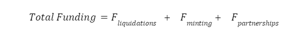

**Price Stabilization Mechanisms**

To ensure that the LUCI token maintains its value, we implement price stabilization mechanisms, especially during pivotal events like minting and burning. The Stabilization Ratio (SR) can be defined as:

 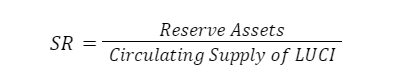

An SR value close to 1 indicates that the token is well-collateralized and stable.

**Liquidations and Price Oracle**

A grace period of 72 hours is set for liquidations when accounts reach a critical threshold, often related to the Minimum Collateralization Ratio (MCR). An algorithm monitors these parameters, triggering automated notifications to users.
The Price Oracle continually adjusts the value P of assets and tokens based on market data.

 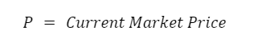

**Policy for Burning and Minting**

The treasury periodically mints new tokens as a method of funding. Minting can also occur when a borrower defaults. Let M be the number of tokens minted, then:

 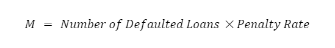

Conversely, burning tokens occurs when a debtor clears their post-default debt. If B is the number of tokens to be burned, it could be calculated as:

 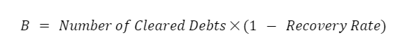

**Liquidity as a Service and AMMs**

To optimize returns, a portion X treasury funds are allocated to liquidity providers and automated market makers (AMMs). This is often a fixed proportion α of the treasury's total available funds T.

 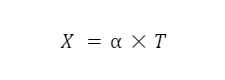

**Flash Loans and Arbitrage Bot**

The treasury employs an arbitrage bot that uses flash loans to seize arbitrage opportunities across decentralized exchanges. The profitability Π of this strategy can be estimated as:

 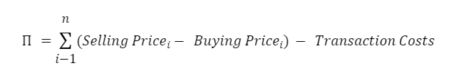

**Example**

Assume that the treasury has total available funds of 10,000 LUCI and wants to allocate 20% to liquidity providers and AMMs. In this case:

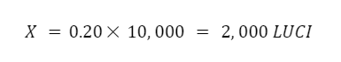

This treasury model, coupled with an array of algorithms and external partnerships, aims to dynamically respond to market conditions and user behavior, safeguarding the ecosystem's stability and financial health.

## 4. System Functionality

### 4.1 Borrower Operations

The Barn architecture within the Lucia Protocol permits users to access liquidity in a fully decentralized, permissionless environment through the establishment of individual collateral accounts, known as Sheds. Upon depositing collateral into a designated Shed, the assets are securely encased within the overarching Barn system, thus authorizing the user to draw liquidity in the form of LUCI stablecoins up to 100% of the asset's existing dollar valuation.

**Collateral Management: Shed Initialization and Asset Locking**

Upon depositing collateral into a designated Shed, users are empowered to draw liquidity through the Lucia Protocol's native stablecoin, LUCI, up to a ceiling defined by the existing dollar valuation of the collateral assets. The maximum liquidity draw is governed by the formula:

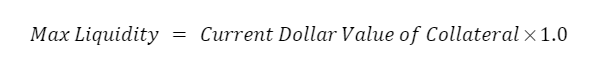

**Minimum Collateralization Ratio (MCR)**

Each Shed is subject to a Minimum Collateralization Ratio (MCR) that varies in relation to the user's credit risk score. The MCR is an important constraint and is expressed as:

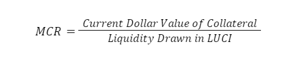

Essentially, each Shed must adhere to a Minimum Collateralization Ratio (MCR), calibrated in accordance with the user's associated credit risk score. This ratio serves as an equation between the collateral's current dollar value and the amount of liquidity withdrawn in LUCI stablecoins.

Borrowers retain the flexibility to either pay down or augment their liquidity within the constraints of the established MCR. The protocol additionally enables users to improve their borrowing capacity as they cultivate a positive repayment history, thereby elevating their credit score. Users can equally recover their collateral within the same MCR limits, conferring upon them complete asset management autonomy.

**Borrower Flexibility and Credit Score Improvement**

Borrowers can choose to either repay their loans or expand their liquidity, provided these actions are within the confines of the predetermined MCR. The system also supports the enhancement of borrowing capacity as a function of positive repayment history, which subsequently elevates the user's credit score.

**Replenishment and Minimum Debt Thresholds**

Sheds can be replenished with additional collateral, thereby increasing the available LUCI liquidity. To maintain system integrity, a minimum debt threshold of 250 LUCI is imposed.

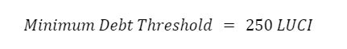

#### 4.1.1 Borrowing Fees:

The Lucia Protocol employs a one-time Borrowing Fee mechanism for the issuance of LUCI stablecoins. This fee structure is specifically designed to be both transparent and equitable, allowing borrowers to manage their capital costs with ease. The Borrowing Fee is calculated through a formula that incorporates a foundational base rate plus an additional 0.5% margin (as elaborated in Section 4.3, "Redemption Mechanism: Redemption Fee and Base Rate"). This sum is then multiplied by the volume of liquidity drawn by the borrower to arrive at the total fee.

**Borrowing Fee Mechanics**

A one-time Borrowing Fee is applied upon the issuance of LUCI stablecoins. This fee is computed using the formula:

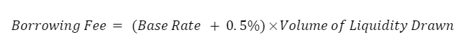

The range of the Borrowing Fee is bounded between 0.5% and 5%:

The Borrowing Fee framework is engineered to correlate fees directly with the amount of liquidity utilized, thereby ensuring a fair system for all protocol participants. Fees are bounded within a specified range: the minimum Borrowing Fee is set at 0.5%, and the maximum cap is 5%. 

**Example:** 

Assume a base rate of 0.5%. The effective Borrowing Fee would then be 1% (0.5% base rate + 0.5% additional margin). If a user deposits 2 USDT to mint 2,000 LUCI, the incurred fee would be 20 LUCI, leading to a total debt of 2,020 LUCI.

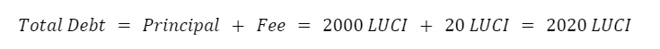

Upon settling this total debt, borrowers can reclaim their collateral and any remaining funds in the Liquidation Reserve.

### 4.2 Lender Operations

Within the Lucia Protocol, Lenders, also  known as Liquidity Providers (LPs) play an integral role, contributing liquidity to facilitate various financial operations. The lifecycle of liquidity provision within this protocol is outlined as follows:

**Initiation by Liquidity Providers**

Liquidity Providers can commence their operations by specifying the amount of the asset they wish to provide as liquidity, followed by confirmation of the deposit. Upon successful processing, the protocol issues liquidity tokens to the LPs.

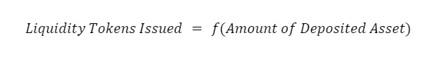

**Interest Accrual and Incentives**

After the initial year, borrowers begin to accrue interest on any outstanding balance they hold. Borrowers are incentivized with a 1.75% reward per transaction, and an additional 1.75% for punctual repayment. Liquidity providers are rewarded a share of the accrued interest based on their stake in the liquidity pool.

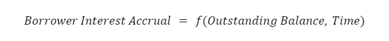

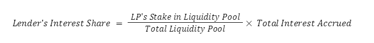

**Liquidity Management**

Lenders have the latitude to manage their liquidity according to market conditions and their investment strategies. They can initiate partial or complete withdrawal at any time, subject to terms specified in the agreement. Withdrawal prior to the agreed timeframe incurs a fee.

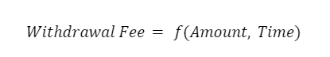

**Monitoring and Adjustment**

Lenders are advised to continually monitor their liquidity performance and the prevailing market conditions. Based on variables like interest rates, asset volatility, and their risk tolerance, lenders might consider revising their liquidity provision strategy.

### 4.3 Silo Operations

The Silo functions as the cornerstone in preserving the fiscal health and systemic stability of the Barn Protocol. This section provides an overview of its operational mechanisms, designed to neutralize debts from defaulted Sheds and reward active participants, known as Silo Contributors.

**Deposit Mechanics: Silo Contributors**

Holders of LUCI tokens can opt to become Silo Contributors by transferring their tokens into the Silo. Generally, these deposits are accessible for withdrawal, unless they are earmarked for debt neutralization from defaulted Sheds. In such instances, withdrawals are temporarily suspended.

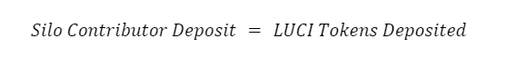

**Liquidation Process: Managing Under-Collateralized Sheds**

If a Shed defaults, an amount of LUCI equivalent to the Shed's debt is destroyed ('burned') from the Silo's liquidity pool. Simultaneously, the Silo receives the full collateral from the liquidated Shed. Since liquidations happen just below the set debt risk ratio, this usually results in a net asset gain for the Silo Contributors.

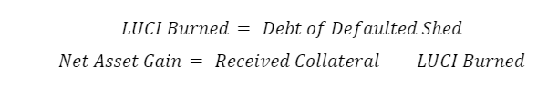

**Collateral Gain Distribution: Proportional Allocations**

The share of collateral gains allocated to each Silo Contributor is computed based on their proportionate share of the total LUCI in the deposit pool at the time of liquidation.

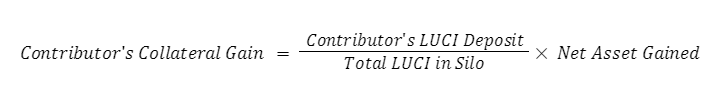

**Withdrawal and Reallocation Options: Flexibility for Contributors**

Contributors can opt to withdraw either the entirety or a segment of their residual LUCI deposits. The system automatically disburses the full collateral gain to the contributor at the point of withdrawal. For those who are also borrowers within the Sheds, an option is available to allocate their collateral gains towards their own Sheds.

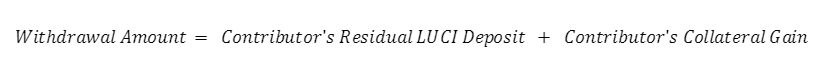

### 4.4 Redemption Mechanism

The Lucia Protocol employs a sophisticated Redemption Mechanism to ensure the stability and redeemability of its native stablecoin, LUCI. This mechanism serves as a critical component in maintaining asset value, offering arbitrage opportunities, and enhancing overall system robustness. 

**LUCI: A Fully Redeemable Stablecoin**

LUCI operates as a fully redeemable stablecoin that provides holders with the option to convert their tokens into various collateral types at face value, based on prevailing exchange rates. This feature creates a price floor for LUCI and aligns its value closely with established stable assets like USDT, USDC, and DAI.

**Redemption Process: Debt and Collateral Balancing**

In the event of a redemption, LUCI tokens are employed to neutralize debts in Sheds that have surpassed the predefined collateral risk ratio. An equivalent amount of collateral is shifted from these Sheds to the redeeming party. This transaction essentially nullifies any net losses for borrowers, thereby promoting a balanced and equitable environment for all participants.

**Systemic Impact: Enhanced Robustness and Stability**

The redemption mechanism amplifies the system's overarching collateralization levels, thus enhancing its robustness and price stability. Given that Sheds with suboptimal collateralization ratios (CRs) are settled first, this fosters increased user confidence in the long-term prospects of the Lucia Protocol.

**Automatic Shed Closure: Reclaiming Collateral Surplus**

Once a full redemption and debt nullification process is complete, the Sheds are programmatically closed, allowing borrowers to recover any leftover collateral. This ensures that borrowers resume complete control of their assets post-liability settlement.

**Redemption Fee and Base Rate Calculation**

The Lucia Protocol employs a dynamic fee structure for redemptions, initially set at a base rate of 0%. For each redemption event, this base rate is recalibrated using the formula:

Here, m represents the amount of LUCI redeemed, \(n\) indicates the current LUCI supply, and a is a constant parameter set at 0.5. This base rate is subject to decay, accounted for using the following formula:

Where S signifies an hourly decay factor (0.944 in our case), and A_t denotes the time elapsed in hours since the last redemption or loan issuance.
The redemption fee is calculated as:

This fee is subtracted from the redeemed LUCI, effectively reducing the collateral returned to the redeemer.

The Lucia Protocol's Redemption Mechanism is meticulously engineered to support both token stability and user fairness. By offering direct arbitrage opportunities, ensuring equitable treatment for borrowers, and optimizing the fee structure, the Lucia Protocol fosters a resilient and equitable financial ecosystem.

### 4.5 Credit Reputation

The Lucia Protocol introduces a multi-faceted Credit Reputation System, designed to assess and ascertain a borrower's eligibility for future loans through a dynamically computed credit rating. This credit rating is calculated using a variety of parameters, each contributing to the overall creditworthiness of the borrower. Below is a mathematical representation of some of these factors:

**Number of Repaid Loans:** The credit score positively correlates with the number of successfully repaid loans. The parameter emphasizes the importance of a strong, consistent repayment history.

**Credit Score of Adjacent Guarantors:** As per the Ethereum Improvement Proposal EIP-6551, the credit rating is also influenced by the credit scores of adjacent guarantors in a tree-like structure, where the borrower serves as the root node.

**Transaction History:** Upon linking their wallet(s), borrowers share their transaction history. While not a direct measure of creditworthiness, a substantial volume of healthy transactions can enhance the credit score.

**Average Timeframe for Past Loan Repayment:** Borrowers agree to repay loans within preset periods (e.g., 1 day, 3 months, 6 months, 9 months, or 12 months) upon initial agreement. This repayment adherence impacts the credit score.

**Number of Past Collateral Liquidations:** Recurrent liquidation events can erode the credit score, signaling potential challenges in loan repayments.

**Fraud Attempts:** Instances of fraudulent behavior will lead to credit score reduction, and in severe cases, account suspension. Users must substantiate if their accounts were compromised to rectify this impact.

This Credit Reputation System strives to create a robust, transparent, and accountable framework for borrowers within the Lucia Protocol. By considering a wide spectrum of both positive and negative behaviors, the system ensures a balanced and fair assessment of creditworthiness.

### 4.6 Liquidation

The Lucia Protocol sets forth a robust Liquidation Mechanism to ensure the seamless operation of the lending ecosystem. This mechanism engages when borrowers fail to fulfill their debt obligations in a timely manner, as stipulated in the lending agreement.

**Terms of Agreement: Adherence to Loan-to-Value (LTV) Thresholds**

Borrowers are mandated to comply with the agreed Loan-to-Value (LTV) thresholds. Failure to do so results in the triggering of a liquidation process, managed by designated collateral liquidators. This process culminates in the full settlement of the outstanding debt.

**Grace Period: Allotted Time for Loan Repayment**

For borrowers approaching the predetermined LTV threshold, the system provides a grace period of up to 12 hours to fulfill their loan repayment responsibilities. If the debt remains unsettled after 72 hours, the liquidation process is initiated.

**Liquidation Event: Collateral Liquidators' Role**

Collateral liquidators are empowered to repay borrowers' loans before the LTV threshold is degraded to a critically low level of 0.0133%. These liquidators act to preserve the system's integrity and are remunerated with a reward for their services.

The Liquidation Mechanism within the Lucia Protocol is carefully structured to ensure borrowers fulfill their debt obligations and to maintain the overall health of the lending ecosystem. It comprises a set of rules and actions, facilitated by collateral liquidators, to manage and settle default risks effectively. 

Example Scenario: A borrower's collateralization ratio drops from 80% to 79%.

| Field | Value |
| --- | --- |
| Total Borrowed Amount | $1000 |
| Total Collateralized Amount | $790 |
| Total Liquidatable Amount | $13 |
| Liquidator’s Share | $2.60 |
| Protocol’s Share | $3.90 |
| Borrower’s Share | $6.50 |

Liquidations are conducted both internally and by third-party entities.

When a loan is liquidated, it adversely affects the borrower's credit score, potentially complicating future credit requests. Furthermore, other penalties will be imposed:

- A negative impact on the borrower's credit reputation.
- The borrower's credit limit for future loans will be capped at $200.
- A higher repayment interest rate of 21% will be applied to borrowers with outstanding balances.

In cases where a borrower deliberately defaults, liquidation will be initiated.

A simplified formula for collateral liquidation is as follows:

In this equation, Collateral Amount refers to the value of the provided collateral, where Loan Amount represents the borrowed sum. Liquidation Threshold signifies the minimum collateral ratio necessary to sustain the loan.

### 4.7 Credit Default Risk

Lucia Protocol introduces a novel Credit Default Insurance (CDI) feature, akin to traditional financial insurance mechanisms, designed to provide coverage against unexpected credit events. This robust framework consists of risk pooling, risk transfer, and indemnification processes that collectively fortify the financial ecosystem.

Core Concepts of Lucia Credit Default Insurance

**1. Risk Pooling**

In this model, individual risks are aggregated into a communal pool, thereby diluting the financial impact of adverse events on any single participant. Contributors are only liable for the average loss, calculated across the entire pool.

The Risk Pool P is a collective sum of individual risks (r_i)

The average loss (L_avg) across the pool is calculated as: 

**2. Risk Transfer**
Rather than an individual bearing the brunt of an unforeseen event, the risk is transferred to the Lucia Protocol, which acts as the insurer.

**3. Indemnification**

In case of a default or another qualifying event, the affected parties are either fully or partially compensated for their losses from the communal insurance pool.

**Mechanism Design: Premiums and Payouts**

The Lucia Insurance contract is hinged on two core elements:

 - Equitable Premium: 
    - The equitable premium(EP) depends on the level of risk r transferred into the pool and is computed using Lucia’s proprietary risk models: 

    

 - Contingent Payouts: 
    - In the event of a default, the payout (Payout) is disbursed, calculated based on predefined metrics in the insurance contract:

    

To cover potential insurance payouts, the Lucia Protocol levies a risk premium, also referred to as the equitable premium. This premium quantifies the level of risk being transferred into the pool, as determined by Lucia Protocol's credit risk scoring and supplemental financial models.

**Operational Costs and Investment Strategy**

The total premium (TP) also includes an administrative component (AC) to cover the operational costs associated with risk management:

By investing a portion of these collected premiums in "insPlot," additional revenue (R) is generated. 

**Risk Assessment and Management**

In terms of risk management, Lucia Protocol adheres to the Law of Large Numbers to mitigate risks. With a diversified customer base, the overall risk is spread out and becomes statistically manageable, allowing Lucia to gradually lower premiums over time.

**Seven Key Functions of Lucia Credit Default Insurance**

 - Pool Control
 - Equitable Premium Calculation
 - Reinsurance Arrangement
 - Advanced Risk Management
 - Fund Investment
 - Claim Payment Oversight
 - Claim Solvency Assurance

The Lucia Protocol CDI serves as an internal mechanism to transfer credit default risks from the creditor to a well-managed communal pool. In the event of a borrower's default, the insurance coverage kicks in to indemnify the creditor, thereby maintaining the financial integrity of the entire ecosystem. 

#### 4.7.1 CDI Architecture:

The proposed architectural framework aims to address the specific risks associated with under-collateralized loans in the Lucia Protocol, effectively creating a decentralized marketplace for lending. Figure 2 illustrates the structural components of this insurance mechanism.

**Utilizing Stable Crypto Assets for Premium Payments**

It's worth emphasizing that the Lucia Protocol opts for stable cryptocurrency assets, such as USDT, USDC, and DAI, as the preferred medium for insurance premium payments. This strategic choice mitigates the volatility risks often associated with cryptocurrency-to-fiat currency exchange rates. Additional asset types will be considered for future integration.

**Independence and Modularity of Lucia's Credit Default Insurance (CDI)**

From an architectural standpoint, Lucia Protocol employs its proprietary Credit Default Insurance (CDI) solution. This is specifically tailored to safeguard both users and lenders participating in Lucia's lending activities. Notably, our CDI operates via a dedicated smart contract, which is distinct from any other lending protocols and solely manages the insurance logic for our unique lending framework.

**Flexibility of the Architectural Design**

The architecture is modular by design, enabling rapid adaptations and updates to the system as required. This feature enhances the Protocol's agility in responding to market demands and risk landscapes.

#### 4.7.2 Smart Contract-based Architecture of CDI System:

**Tokenomics and Economic Incentives**

Lucia Protocol's CDI system is orchestrated around two distinct tokens: LCI NFT and stLCI. The LCI NFT serves as an insurance token, capturing the various functionalities typical of an insurance company. The pricing for this token comprises two key components: the risk premium, accounting for the calculated risk of the insured event, and an administrative fee that maintains operational costs and contributes to the governance pool's stability.
Simultaneously, stLCI functions as a governance token, conferring voting rights to its holders and thereby enabling them to influence key protocol decisions. stLCI holders also benefit from multiple revenue streams such as merchant processing fees, outstanding balance rates, repay balance rewards, and more. Acquiring LCI NFT becomes possible when users provide liquidity to 'Silos,' and stLCI tokens are earned through staking in 'Plots.'

**Dual-Pool Structure: insPlot and stLCI Pool**

The architecture necessitates two distinct pools, namely insPlot and stLCI, each serving a specific purpose. While insPlot is responsible for issuing insurance tokens and maintaining liquidity for claim settlements, the stLCI pool reallocates any surpluses and provides emergency capital.

**Governance and Emergency Board**

A third component of the architecture is an Emergency Board comprising experts from either the insurance industry or smart contract auditing sector. The board members are elected by stLCI token holders, thereby aligning governance with those who have a financial stake in the system's long-term decisions. Incentivizing accurate and honest decision-making, board members also hold stLCI tokens.

**Transparency and Accessibility**

To promote full transparency and empower both customers and investors in decision-making, all pertinent data including transaction volumes, outstanding claims, and capitalization ratios will be made publicly accessible. This not only enables a comprehensive evaluation of the project's performance but also facilitates efficient claims management and voting procedures.

### 4.8 Risk Management

**Capitalization and insPlot Funding**

The initial capital inflow for the insPlot pool will primarily be sourced from the Security Token Offering (STO), public sales, additional listings, and partnerships with liquidity providers. Liquidity providers are incentivized to stake LCI tokens into the insPlot pool, particularly during the project's nascent stages when valuation is comparatively low. This mechanism not only allows them to accumulate a larger stake in the project but also to partake in shared revenue streams, as elaborated in prior sections. 

This incentive is calculated as a function of the initial valuation V and the revenue share R:

**Risk Evaluation and Premium Structuring**

The Lucia Credit Attribution score serves as the cornerstone for risk evaluation, subsequently influencing the insurance premium levels. The granular data provided by this scoring model are instrumental in precisely tailoring the insurance fees. The individualized nature of each lender and "Shed" introduces a variance in risk profiles. Borrowers with positive credit attribution scores, a sound repayment history, and a stable current "Shed" are generally subjected to lower fees.
The Lucia Credit Attribution Score (S) is integral to risk evaluation. The individualized risk premium (RP) for insurance is calculated as: 

**Dynamic Fee Structuring**

When a sudden surge in claims occurs (𝛥Claims), either for a specific borrower or within an asset "Barn" pool, the insurance fee structure is recalibrated. The new fee (New_Fee) is calculated as: 

**Community-Based Fee Voting**

The community's vote (V_community) for a balanced fee is modeled as:

**Compliance with Traditional Regulatory Frameworks**

In an effort to ensure financial stability and stave off insolvency, Lucia Protocol intends to adhere to established capital requirements analogous to traditional insurance providers. Specifically, compliance will align with the **Solvency II Supervisory System laid out in Article 101**. Accordingly, a confidence level of 99.5% must be maintained, signifying the probability of meeting all payment obligations over a one-year horizon. The coverage ratio, representing the ratio of worst-case scenario capital requirements to Lucia Protocol's own reserves, must equate to 100%. In simple terms, this stipulates that Lucia Protocol must maintain sufficient capital reserves to weather adverse financial conditions, thereby providing insurance customers with a 100% coverage ratio.

### 4.9 Insurance Claims & Entitlements

In the decentralized financial landscape, the handling of claims is a critical element that speaks to the credibility and reliability of any insurance protocol. The Lucia Protocol aims to offer a robust, transparent, and user-centric Claims and Entitlement Process. This section delineates the various steps, options, and guidelines involved in filing and resolving a claim within the Lucia Protocol's Credit Default Insurance (CDI) framework. From initial filing to final resolution, the protocol integrates community voting and expert oversight to ensure an efficient, fair, and secure claims process.

**Filing a Claim**

Upon the occurrence of an event triggering a claim, the affected party initiates the process as outlined in Figure 2. To curb malicious activities like spam or false claims, the Lucia Protocol requires a claim filing fee. This fee is refunded upon successful adjudication and is calculated as a percentage of the claim amount and is also contingent on the chosen valuation method.

**Decision Pathways**

Claimants have two options for the resolution process:

 - Community Voting (Low Fee): The claim is submitted to the insurance pool participants for community voting. If a 75% consensus is reached in favor, the payout is processed.

 - Emergency Board (High Fee): Bypassing community voting, claimants can opt to escalate the case directly to the emergency board.

**Payment Mechanism**

If approved, claimants receive their awarded sum directly from the insurance pool into their digital wallet. If a claim fails to garner a 75% approval via community voting (Option 1), the claimant can escalate to the emergency board. The board's decision is final, and in cases of uncertainty, external IT-audit experts may be consulted for independent analysis.

**High-Value Claims and Security Safeguards**

Claims exceeding the insurance pool's total value are automatically routed to the emergency board to prevent the possibility of fraudulent collusion within the pool.

**Guidelines and Exclusions**

 - Reporting Deadline: A 7-day window is provided to report the incident, ensuring ample time for the affected parties.
 
 - Coverage Scope: Covered events include credit defaults, hacks, coding errors, and manipulations that result in capital loss.

 - Exclusions: Losses stemming from the mismanagement of private keys are not covered. Claimants must prove ownership of the corresponding wallet by signing a transaction with a specific code.
 
 - Fraud Prevention: Lucia Protocol's attribution and reputation system is integrated to deter fraudulent activities. The blockchain's inherent transparency further aids in the easy identification of such activities.

### 4.10 Governance & Investments

Lucia Protocol has implemented a multi-faceted approach to capital allocation and community governance within its insurance application. This section delineates the protocol's strategies for prudent capital investment and describes the governance mechanisms that allow for dynamic, community-driven decision-making. 

**Capital Allocation and Investment Strategy**

Lucia Protocol's insurance application aims not just to offer insurance solutions but also to generate additional revenue streams. The capital raised from insurance premiums, administration fees, and other operational revenues are invested prudently to yield returns. Specifically, funds could be allocated into low-risk financial instruments such as Treasury Bills and bonds to mitigate the associated investment risks. The generated returns could serve a dual purpose: to reduce insurance fees thereby attracting more customers, and to be distributed as rewards to stLCI governance token holders. The exact allocation strategy would be determined by stLCI token holders, aligning the investment approach with community interests.

**Governance Mechanisms**

The efficacy and resilience of decentralized systems like the Lucia Protocol are often rooted in robust governance mechanisms. Governance, in this context, serves as the cornerstone for Lucia Protocol’s ecosystem. This democratic approach is embodied through the stLCI governance tokens. Holding these tokens not only represents a stake in the project but also confers voting rights on critical aspects of the protocol. The ensuing discussion details the pivotal roles that stLCI token holders play in governance, including voting on protocol rules and initiating emergency halts in extraordinary circumstances.transparent decision-making and provides a structured avenue for community involvement. 
The following sections delve into the intricacies of the Lucia Protocol's governance, highlighting how token holders can actively participate in shaping the protocol and how emergency measures are activated in critical situations.

**Voting Mechanisms**

Individuals holding governance tokens possess the capability to shape the protocol's foundational guidelines. This includes, but is not limited to, the modification of fee structures and the adjustment of risk parameters, which are collectively determined through a decentralized voting process among token holders.

The power of voting P_v or an individual token holder is proportional to the number of stLCI tokens (T)they hold:

Decisions are made based on the collective voting power P_total of all participating stLCI token holders:

A proposal is passed if P_total surpasses a certain threshold of θ :

**Contingency Protocols**

In the case of emergency situations, a special halt function H can be initiated by stLCI token holders vested with governance rights. The weight of each holder's authority to initiate a halt W_h is represented as:

An emergency halt is initiated if the weighted sum of the votes W_total crosses a specific emergency threshold ϵ:

**Transparency and Community Involvement**

Transparency is maintained through a transparent ledger, where all votes V and associated parameters X are publicly recorded: 

The Lucia Protocol ensures a comprehensive and democratic governance structure, facilitated through stLCI tokens. This allows for a decentralized approach to decision-making concerning fee structures, risk parameters, and emergency halts, thereby ensuring a resilient and transparent governance mechanism. 

### 5 Rewards System

#### 5.1 Lenders:

Within the Lucia ecosystem, lenders are not only participants but also beneficiaries of the liquidity provision process, rewarded for their pivotal role in facilitating transactions. To participate, lenders are required to contribute to the liquidity pool by providing supported tokens such as USDC, USDT, AVAX, MATIC, and ETH.

**Bonds as Debt Securities:**

To enable liquidity providers or lenders to supply their resources, a novel avenue emerges in the form of bonds. Bonds are issued with specific contractual terms and maturity dates, offering lenders both security and potential returns.

**Bond Coupon Formula:**

Bonds signify a form of debt security, with Lucia acting as the issuer, indebted to bondholders who serve as lenders or liquidity providers. The terms of the bond define Lucia's commitment to repay the principal and interest payments, colloquially referred to as "coupon," upon maturity.

The bond mechanism underscores mutual responsibilities: Lucia pledges to issue bonds at a discounted rate, providing corresponding interest as outlined in the bond agreement. Simultaneously, lenders obligate themselves to lock funds, accessing them exclusively upon the agreed maturity period to claim stipulated interests.

Compared to volatile stocks, bonds generally exhibit lower volatility, particularly evident in short and medium-term bonds, rendering them comparatively safer investments. An added dimension unfolds as bonds potentially enter the secondary bond market, presenting opportunities for trading.

**Profit-Sharing:** Revenue from various channels such as insurance premiums and investment returns may be distributed among lenders.

**Governance Tokens:** Lenders are awarded stLCI governance tokens which offer both voting privileges and an ownership stake in the protocol.

#### 5.2 Borrowers:

Within the Lucia ecosystem, borrowers also have the opportunity to earn rewards. A strong track record characterized by Lucia Credit Attribution scores and punctual loan repayments can result in discounted insurance premiums for these borrowers. Additionally, upon full repayment of a loan without any penalties, borrowers can qualify for a cashback incentive of 3.5%, which is disbursed in the form of Lucia's proprietary token, LUCI.

Debt Repayment Rewards Formula: 

#### 5.3 Token Rewards:

An established method for allocating rewards within the Lucia ecosystem is rooted in a straightforward formula: Parameters within this formula include the Total Reward Pool, indicative of tokens designated for rewards over a specific period. 

**Reward Formula:** 

**Supported Stablecoins:** USDC, USDT, and DAI are among the stablecoins accepted for liquidity provisioning.

**Custom Liquidity Pools:** Users can form their own liquidity pools by maintaining an initial 50/50 balance of both tokens involved.

## 5. Conclusion

Lucia Protocol is not just another lending and borrowing platform; it's an ecosystem designed to redefine how we think about credit and insurance. Our non-custodial platform creates an empowering, trust-based space for both individuals and startups seeking credit for growth. Unlike traditional systems, our technology uses cutting-edge credit assessment methods to understand borrowers' needs in real-time, thereby supporting them at every stage of their journey.

At the core of our innovations is the Lucia Protocol Credit Default Insurance (CDI), a technology running on the reliable Ethereum blockchain and compatible with the broader Ethereum Virtual Machine (EVM). This doesn't merely bring insurance into the digital age; it catapults it into the future. The smart contracts-based system we've designed doesn't know what office hours are; it's working around the clock to provide secure, fast, and transparent services. Compared to the time-consuming and often opaque procedures in conventional insurance, Lucia Protocol's blockchain-based solutions are a paradigm shift.

This is not automation for automation's sake. Our smart contracts enable real-time, automated payouts based on predefined rules, virtually erasing the headaches usually associated with claim disputes. Transparency is non-negotiable; every policy term is publicly recorded on the blockchain, thereby discouraging fraud while fortifying trust. We do understand that not everyone is a fan of full transparency, so we've incorporated a user-friendly dashboard that allows you to see key data at a glance, without diving into the blockchain details.

Lucia Protocol is on a mission to democratize financial services and make them accessible to all. With this protocol, we're making strides toward financial inclusion, extending our reach to sectors of society traditionally left out of the insurance and lending game.

Lastly, financial optimization is a key feature, not an afterthought. The premiums collected are not just sitting idle; they are securely locked in Ethereum smart contracts and strategically managed by governance token holders. This dynamic allows for multiple capital utilization strategies, including staking and liquidity mining, aimed at maximizing returns for all stakeholders in the ecosystem.