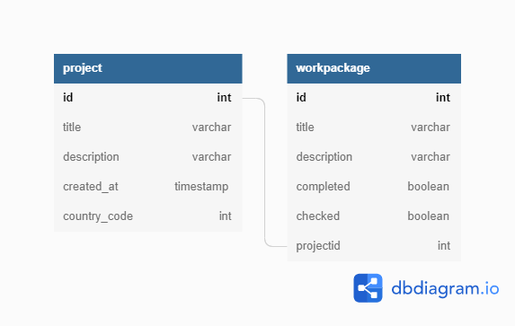
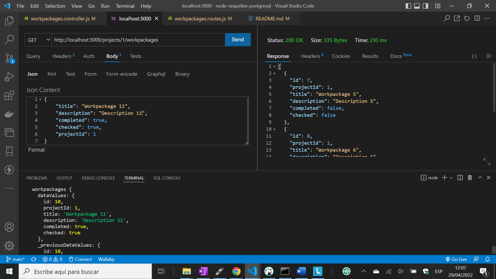

# :zap: Node Sequelize PostgreSQL

* Node.js + Express used with Sequelize Object-Relational Mapping (ORM) to perform promise-based Create, Read, Update & Delete (CRUD) operations on linked data tables in a PostgreSQL database


## :page_facing_up: Table of contents

* [:zap: Node Sequelize PostgreSQL](#zap-node-sequelize-postgresql)
  * [:page_facing_up: Table of contents](#page_facing_up-table-of-contents)
  * [:books: Browser Fingerprint Data](#books-browser-fingerprint)
  * [:books: General info](#books-general-info)
  * [:camera: Screenshots](#camera-screenshots)
  * [:signal_strength: Technologies](#signal_strength-technologies)
  * [:floppy_disk: Setup](#floppy_disk-setup)
  * [:wrench: Testing](#wrench-testing)
  * [:computer: Code Examples](#computer-code-examples)
  * [:cool: Features](#cool-features)
  * [:clipboard: Status & To-Do List](#clipboard-status--to-do-list)
  * [:clap: Inspiration](#clap-inspiration)
  * [:file_folder: License](#file_folder-license)
  * [:envelope: Contact](#envelope-contact)


## :books: Browser Fingerprint

* Must be able to receive payloads such as


```js
{
  "customer_address": "0xef1c6e67703c7bd7107eed8303fbe6ec2554bf6b",
  "user_agent_string": "Mozilla/5.0 (X11; Ubuntu; Linux x86_64; rv:15.0) Gecko/20100101 Firefox/15.0.1",
  "system_info": "",
  "os": "",
  "cpu": "",
  "browser_info": {
    "name": "",
    "version": "",
    "build_number": ""
  },
  "available_size": 1024,
  "screen_size": {
    "width":1024,
    "height":768
  }
}
```

Incoming queries via postman or clientside must be made by double wrapping

```json
{
  "fingerprint": {
      "jsonData": {
        "customer_address": "0xef1c6e67703c7bd7107eed8303fbe6ec2554bf6b",
        "user_agent_string": "Mozilla/5.0 (X11; Ubuntu; Linux x86_64; rv:15.0) Gecko/20100101 Firefox/15.0.1",
        "system_info": "",
        "os": "",
        "cpu": "",
        "browser_info": {
            "name": "",
            "version": "",
            "build_number": ""
        },
        "available_size": 1024,
        "screen_size": {
            "width":1024,
            "height":768
        }
        }    

  }    
}

```


## :books: General info

* SQL database data based on Sequelize Project and Workpackage models
* Node.js project structure best practises observed with separate routes & controller code
* The use of Projects and Workpackages is based on my Engineering experience in Norway where all Maintenance and Modification projects are documented in engineering workpackages that all have a unique workpackage id number and are tied to a project using the project id number

* Project Structure:

```bash
├── package.json
└── src
  ├── app.js
  ├── controllers
  │  ├── projects.controller.js
  │  └── workpackages.controller.js
  ├── db
  │  └── database.js
  ├── index.js
  ├── models
  │  ├── Project.js
  │  └── Workpackage.js
  └── routes
    ├── projects.routes.js
    └── workpackages.routes.js
```

* Database Overview:



## :camera: Screenshots



## :signal_strength: Technologies

* [Node.js v16](https://nodejs.org/) Javascript runtime using the [Chrome V8 engine](https://v8.dev/)
* [Express v4](https://www.npmjs.com/package/express) web framework for node
* [Sequelize v6](https://sequelize.org/) TypeScript and Node.js Object-relational mapping (ORM) for Postgres, MySQL, MariaDB, SQLite and SQL Server
* [DBeaver relational database tool](https://dbeaver.com/) used to connect to a PostgreSQL database
* [PostgreSQL v14](https://www.postgresql.org/) object-relational database
* [DB Diagram](https://dbdiagram.io/) used to create the Database Overview
* [Structure-codes CLI](https://github.com/structure-codes/cli) used to create the Project Structure
* [morgan v1](https://www.npmjs.com/package/morgan) HTTP request logger middleware for node.js

## :floppy_disk: Setup

* Assuming you have PostgreSQL database installed, install DBeaver and connect to your PostgreSQL database using DBeaver
* `npm i` to install dependencies
* Create `.env` and add database credentials - see `.example.env`
* `npm run dev` runs app in the development mode with auto-restart.
* Open [http://localhost:3000/api/projects](http://localhost:3000/api/projects) to see projects list in browser
* Open [http://localhost:3000/api/workpackages](http://localhost:3000/api/workpackages) to see workpackages list in browser
* PostgreSQL console can be used to work with database: `\c projects` to connect to projects database, `\dt` to list tables, `SELECT * FROM projects;` to see projects table

## :wrench: Testing

* All CRUD functions tested using Postman

## :computer: Code Examples

* `models/Workpackage.js` Workpackage model using Sequelize.define

```javascript
export const Workpackage = sequelize.define(
  "workpackages",
  {
    id: {
      type: DataTypes.INTEGER,
      primaryKey: true,
      autoIncrement: true,
    },
    title: {
      type: DataTypes.STRING,
    },
    description: {
      type: DataTypes.STRING,
    },
    completed: {
      type: DataTypes.BOOLEAN,
      defaultValue: false,
    },
    checked: {
      type: DataTypes.BOOLEAN,
      defaultValue: false,
    },
  },
  {
    timestamps: false,
  }
);
```

## :cool: Features

* Sequelize is easy to learn and the database synchronisation function is useful


## :clap: Inspiration

* [Sequelize documentation: Model Basics](https://sequelize.org/docs/v6/core-concepts/model-basics/)
* [Sequelize documentation: Model Querying finders](https://sequelize.org/docs/v6/core-concepts/model-querying-finders/)


* This project is licensed under the terms of the MIT license.

## :envelope: Contact

* Repo created by [ABateman](https://github.com/AndrewJBateman), email: gomezbateman@yahoo.com


## In order to create a new route 

Add a new file entry in the `/routes` and `/models` and `/controllers` folder. In app.js you'll need to import them. 


<hr/>

```psql
\l
```

will list all databases

```psql
\dt
```

Will list all tables


Use the credentials in the `.env` file to connect to the local database. 

# Advanced Features

Creating a table for the equity related data models

<hr/>

```sql
CREATE TABLE security (
  title VARCHAR(255),
  description VARCHAR(255),
  content VARCHAR(255)
);
```

<hr/>

A Safe can be `pre-money` or `post-money`


```sql
CREATE TABLE safe (
  id int,
  name VARCHAR(50),
  valuation_cap VARCHAR(50),
  valuation_cap_denom CHAR(5),
  principal int DEFAULT ,
  principal_denom CHAR(5) DEFAULT 'USD',
  discount int
);
```

<hr/>

A stock grant is a restricted stock award

```sql
CREATE TABLE stock_grant (
  id int, 
  name VARCHAR(50),
  vesting_duration int DEFAULT 4,
  cliff int DEFAULT 1
);
```


<hr/>

A contract can be a security such as a safe or a stock grant

```sql
CREATE TABLE contract (
  id int,
  name VARCHAR(255),
  content VARCHAR(255)
);
```

## Usage

* Open [http://localhost:3000/api/projects](http://localhost:3000/api/projects) to see projects list in browser
* Open [http://localhost:3000/api/workpackages](http://localhost:3000/api/workpackages) to see workpackages list in browser


<hr/>

You can send the following query via Postman

```js


```


